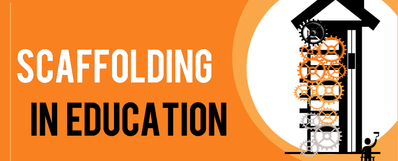

# Andamiaje

**El concepto de andamiaje, equivalente del término inglés "_scaffolding_"**, es un concepto clave en las teorías de la educación más vigentes y es también de los **conceptos fundamentales en AICLE**. A continuación, vamos a tratar todo lo que puede interesarnos en relación con este concepto.

La idea de andamiaje está relacionada con las teorías de [Vygotski](https://es.wikipedia.org/wiki/Lev_Vygotski) (1978), según las cuales, la capacidad de resolución de problemas y otras estrategias se pueden dividir en tres categorías: 1) aquellas que el alumno puede realizar independientemente, 2) aquellas que no puede realizar incluso con ayuda, y 3) aquellas que el alumno puede realizar con ayuda de otros.

Esta última categoría es la que se relaciona con lo que Vygotski denomina “Zona de Desarrollo Próximo (ZPD)", que hace referencia a la distancia existente entre el nivel real de desarrollo del alumno, determinado por su capacidad de resolver un problema por él mismo y el nivel de desarrollo potencial que el alumno puede conseguir si es ayudado por un adulto o en la interacción con un compañero más capacitado. Es aquí donde juega un papel importante el andamiaje que el profesor prepara para que el alumno vaya tomando control de la situación poco a poco, hasta que alcance el nivel de competencia necesario para realizar la tarea por sí mismo (Pérez, I. 2005:261).

**El andamiaje es por tanto aquellas estructuras, actividades o estrategias de apoyo que el profesor aporta para que el alumno construya el conocimiento**. No es simplemente ayudar al alumno dándole la respuesta sino facilitar y proporcionar un soporte que le sirva a aquellos alumnos que así lo necesiten para lograr el objetivo del aprendizaje. **Este andamiaje es fundamental en AICLE y se debe dar tanto para el contenido como para la lengua**. Un ejemplo de andamiaje sería proporcionar una tabla para que el alumno distribuya la información que debe encontrar dado un texto que queremos que trabaje, o una línea del tiempo vacía a completar con los datos a encontrar. Puedes encontrar ideas sobre el tema en el artículo «[seis estrategias de andamiaje didáctico para usar con los alumnos](https://blogcienciesnaturals.wordpress.com/2014/11/26/seis-estrategias-de-uso-de-andamios-didacticos-para-usar-con-tus-alumnos/)».

Fragmento de la infografía realizada por [Mia MacMeekin](https://anethicalisland.wordpress.com) en [Scaffolding | An ethical island](https://anethicalisland.wordpress.com/2013/03/16/scaffolding/)

Siguiendo la clasificación que hace Dodge (2001) vamos a referirnos a tres tipos de andamiaje que se pueden proporcionar dependiendo del momento en que se hace. También mencionaremos algunas actividades que pueden emplearse en cada caso:

1.  **Andamiaje de recepción**. Es aquel que se utiliza para asegurar que los alumnos extraen "la información necesaria y relevante cuando entran en contacto con los recursos en la fase de recepción" con objeto de que el alumno procese y comprenda mejor el contenido que se le da y se fije en lo que el profesor pretende. Algunos ejemplos de este tipo de andamiaje son las "guías de observación y audición, gráficos y tablas organizativas para completar, glosarios comentados, etc.
2.  **Andamiaje de transformación**. En este caso se trata de proporcionar estrategias que permitan la transformación de la información recibida en algo nuevo. "En concreto este tipo de andamiaje ayuda al alumno en procesos como comparar, contrastar, encontrar patrones, valorar, decidir, etc. Ejemplos típicos de andamios de transformación son: diagramas de Venn, tablas de datos o características, ayudas para generar ideas, gráficos, etc."
3.  **Andamiaje de producción**. Es el apoyo que el alumno necesita para crear o producir algo nuevo. Lo más apropiado es proporcionar andamios en relación con las estructuras de los productos que deben de elaborar, como por ejemplo: plantillas de presentación y esquemas, plantillas o guion de escritura, etc.

A lo largo de este curso haremos referencia a este concepto de andamiaje en numerosas ocasiones y también exploraremos algunos recursos que nos pueden ayudar a planificar el apoyo, tanto para el contenido como para la lengua. Los buenos profesores siempre han utilizado actividades que servirán de andamiaje (Dodge, 1998), y u**n profesor AICLE necesitará saber plantear este andamiaje o apoyo de una forma sencilla pero oportuna para facilitar la comprensión y el aprendizaje**.

Seguramente el profesor de materia sabe cómo presentar y hacer más fácil el contenido de su materia, esto mismo ocurre con el profesor de L2 con respecto a la lengua. El profesor de AICLE necesita aprender las estrategias que le permitirán facilitar la lengua de manera que el contenido sea más accesible, para ello la colaboración entre ambos profesionales es de gran ayuda.

\_\_\_\_\_\_\_  

Dodge, B. 2001. "[FOCUS: Five rules for writing a great WebQuest.](http://disciplinas.stoa.usp.br/pluginfile.php/326587/mod_resource/content/0/FOCUS_Five_Rules_for_Writing_a_Great_WebQuest.htm)" Learning & Leading with Technology, 28, 8: 6-9.  
Vigotsky, L. S. 1978. _Mind in Society: The Development of Higher Psychological processes_. Harvard University Press, Cambridge, MA.