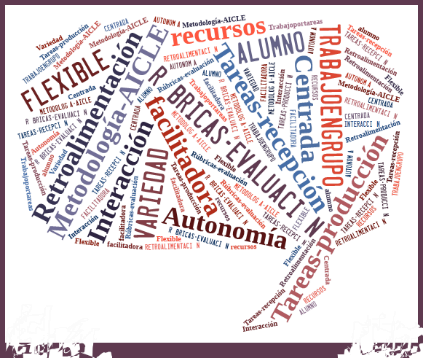

# Elementos y características de la metodología AICLE

En los apartados anteriores se han tratado muchos de los aspectos que son fundamentales a la hora de llevar a cabo una enseñanza AICLE y una enseñanza eficaz en general. Dichos principios y aspectos están relacionados con la metodología que se emplea en un entorno AICLE, aunque en definitiva no es más que una metodología que procura una enseñanza-aprendizaje excelente.

En los tres apartados siguientes, con objeto de aumentar el repertorio de estrategias del profesor AICLE, analizaremos otras características de esta metodología y se enumerarán un considerable número de estrategias y actividades que se pueden emplear a la hora de trabajar en la clase AICLE.

  

