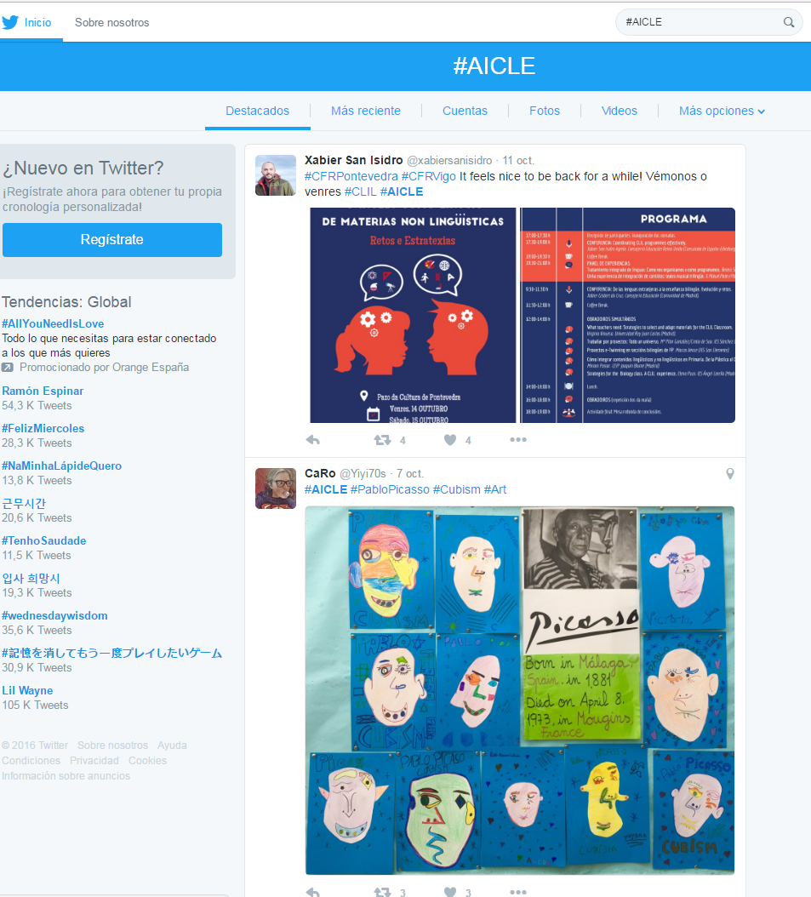
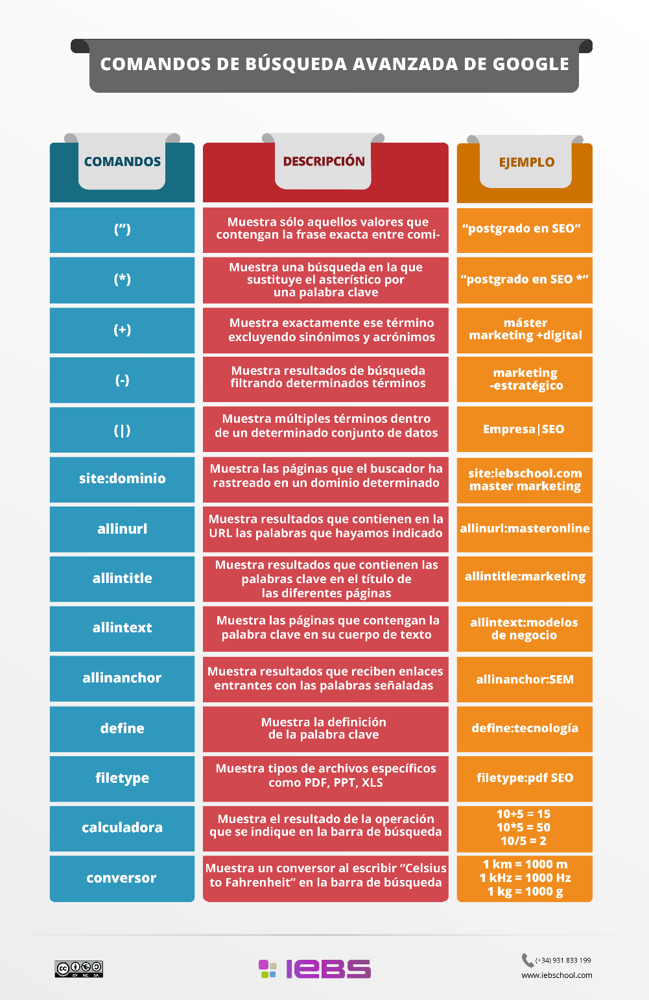

# Estrategias de búsqueda de REA

En el momento de comenzar la búsqueda de recursos para uso en AICLE y de recursos educativos en general, hay que diseñar una  estrategia que nos permita no sólo encontrar, sino también almacenar y difundir dichos recursos sin ahogarnos en la llamada  sobrecarga informativa o “[**Infoxicación**](https://es.wikipedia.org/wiki/Sobrecarga_informativa)” . No existe una fórmula única para encontrar los mejores recursos, pero sí se pueden dar ciertas **orientaciones** que faciliten la búsqueda.

1.  **Visitar sitios web, portales y repositorios educativos** de países donde se habla la L2 en cuestión. En la mayoría de los países desarrollados los organismos educativos oficiales así como diversos medios de comunicación y entidades privadas están creando repositorios de REA y otros recursos a compartir que, aunque puede que no especifiquen un tipo de licencia abierta, sí dejan claro que pueden ser usados para uso educativo insertando un enlace. En concreto en nuestro país existen espacios de este tipo en todas las comunidades que lógicamente se pueden usar para AICLE en donde la lengua objeto sea el español.   
      
    En estos portales los recursos no son en la mayoría de los casos específicos para AICLE pero sí son los correspondientes al currículo de niveles de infantil, primaria o secundaria y pueden ser de mucha utilidad al estar en la lengua objeto. Valgan algunos ejemplos de nuestro país, como el portal de [AGREGA1](http://agrega.educacion.es/visualizadorcontenidos2/Portada/Portada.do;jsessionid=10A682EE35AD8F0D7BCF36BDDFEB4D85 "Portal de AGREGA") o el portal [Educativo de Extremadura ](http://conteni2.educarex.es/ "Portal educativo de Extremadura")o el [Mestre@casa ](http://mestreacasa.gva.es/web/guest/inicio "Mestre a casa: Generalitat Valenciana")de la Generalitat Valenciana; también la comunidad REA AICLE en el repositorio [Procomún](https://procomun.educalab.es/es/comunidades/uso-de-rea-para-aicle); y otros de habla inglesa como el [portal for Irish Education](https://www.scoilnet.ie/) o el portal de [BBC Learning English](http://www.bbc.co.uk/learningenglish/english/) o específico para los más jóvenes [cbeebies](http://www.cbeebies.com/global/), [Learning resources exchange for schools](http://lreforschools.eun.org/web/guest "Learning resources exchange for schools") en varias lenguas o el portal de recursos de [Education Scotland](http://www.educationscotland.gov.uk/learningandteaching/earlylearningandchildcare/resources/index.asp). En el siguiente subapartado recogemos algunos enlaces más de portales de REA.
2.  **Explorar los recursos y materiales seleccionados y/o elaborados por otros compañeros** que igualmente trabajen en AICLE a través de buscadores o en páginas de referencia AICLE o CLIL que conozcamos como por ejemplo ejemplos de materiales en [esta página](http://isabelperez.com/clil/clicl_m_6.htm "Página de enlaces a Materiales CLIL/AICLE de Isabel Pérez"). Ampliaremos este punto en un apartado posterior.
3.  Utilizar diferentes buscadores: [Google](http://www.google.es), [DuckDuckGo](https://duckduckgo.com/) (para no dejar huella) o [instagrok](https://www.instagrok.com/) (si quieres resultados en forma de mapa mental) o explorarando en Twitter los #_hashtags_ que tienen que ver con #AICLE #CLIL. Para ello, no es preciso estar dentro de Twitter, ni siquiera tener una cuenta.

  

A la hora de comenzar una búsqueda, es conveniente que sepamos emplear correctamente la **sintaxis **para encontrar con más facilidad lo que interesa: **+/-** obliga o elimina las palabras; el uso de comillas **"......."** indica que se busca la frase exacta, asterisco ***** sustituye una parte de información que se desconoce. En la siguiente infografía encuentras los operadores más comunes  ¡y efectivos! de la búsqueda en Google.

El uso de palabras clave,  escribir la frase que creemos que aparecerían en el contenido que buscamos facilitan la búsqueda. P.e. si añadimos la palabra _kids_ (+) nos ayudará a encontrar contenido educativo para Primaria y Secundaria (ej. _Moon Earth satellite kids_). Además, también existen [buscadores específicos para niños](https://www.commonsensemedia.org/lists/kid-safe-browsers-and-search-sites), como por ejemplo, [Vikidia](https://es.vikidia.org/wiki/Vikidia:Portada).

1.  Usar la [búsqueda avanzada de Google](http://www.google.es/advanced_search?hl=es) u otros buscadores, lo que nos permitirá, por ejemplo, búsqueda de dominios educativos o de un país determinado (ej. .uk, .us, .edu, .org); o búsqueda de un formato concreto de documento (ej., pdf, .doc, .ppt), o de idioma o incluso el tipo de licencia de uso, tanto para imágenes como para textos. Una de las actividades de este bloque tiene que ver con llevar a cabo búsquedas eficaces. 
    

    

    
2.  Buscar imágenes, audios y vídeos en espacios educativos creados con tal fin y con el interés de ser compartidos, normalmente con licencia pública o abierta. Existen cada vez más repositorios de este tipo. Un ejemplo es el [banco de imágenes y sonidos del INTEF](http://www.ite.educacion.es/en/mediateca "banco de imágenes y sonidos del INTEF"). Ampliaremos este punto en el apartado de imágenes y sonidos.

Guardar

Guardar

Guardar

Guardar

Guardar