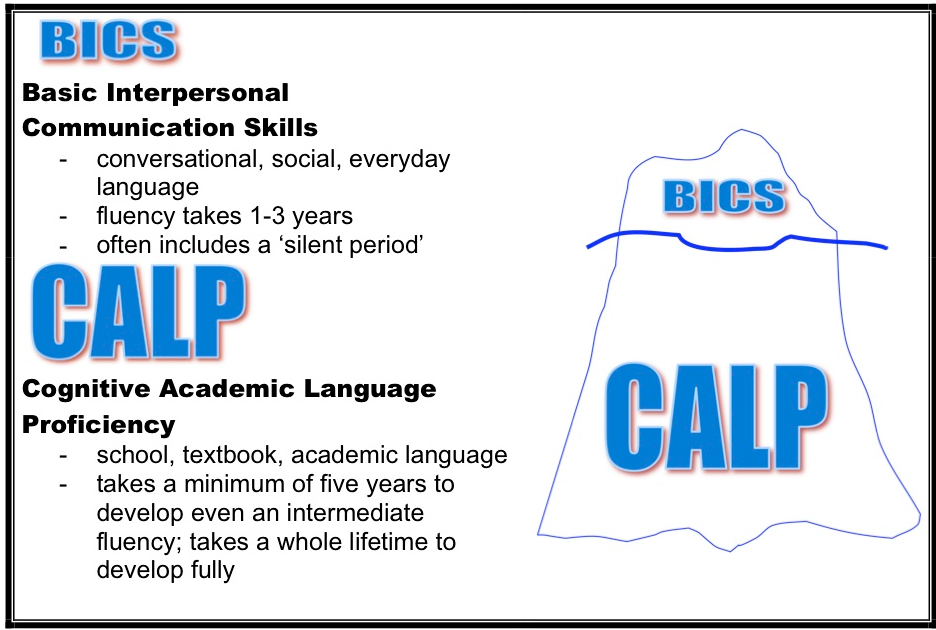

# Identificando la lengua

“Conocer y dominar los distintos registros lingüísticos para la gestión del aula CLIL” (D.L. Fields, 2016) es fundamental para garantizar el éxito de la misma. En el apartado de **Principios básicos de AICLE** hemos hablado de la importancia de la colaboración entre el profesor de la materia AICLE y el profesor especialista de la L2. Uno de los pasos fundamentales a la hora de planificar una unidad o actividad AICLE es **examinar cuál es la lengua que se precisa**. Se trata de aprender igualmente la lengua, porque además será una herramienta fundamental a la hora de adquirir el contenido.

**Por lengua entendemos tanto el vocabulario como las expresiones, frases, estructuras formales y tipo de textos y discursos** (en inglés, _Key words_, _phrases and other academic language for both questions and answers_). Los alumnos necesitarán conocer el tipo de lengua que esté relacionado con el contexto que se esté trabajando en el aula AICLE. Muchas veces será preciso introducir tanto vocabulario como aspectos de gramática que el alumno no ha tratado o al menos no suficientemente en la clase de L2 con anterioridad. Esto se puede hacer en coordinación con la clase de L2 y/o en la clase AICLE. Por otro lado, **las destrezas lingüísticas (leer, oír, hablar y escribir)** se deben desarrollar al hilo de las necesidades del contexto AICLE y seguramente los discursos académicos en los que se deben poner en práctica dichas destrezas serán distintos de los que se trabajan en la clase de L2 pero igualmente se puede trabajar en colaboración una vez que se sabe qué tipo de destreza se necesita trabajar.

Se trata de identificar no sólo las palabras, expresiones o estructuras gramaticales necesarias para comprender el contenido, sino también de prever cuáles de estas pueden provocar confusión en el alumnado. P.e., el término “[_relief_](https://en.oxforddictionaries.com/definition/relief)” puede haberse aprendido en la clase de inglés, pero adquiere otro significado en la clase de geografía (o viceversa).

Tomemos el ejemplo de una clase AICLE de matemáticas: Los textos matemáticos suelen ser concisos y llenos de símbolos y terminología específica que se trabajarán en la clase de matemáticas. En cuanto a las funciones de la lengua, una característica típica de la lengua matemática es el uso de expresiones de hipótesis y predicción (ej.: "_the answer will be less than 58"_; "_if.....then_"), por lo que, cuando surjan estas funciones, se usarán expresiones de futuro y condicionales. En cuanto a las destrezas comunicativas, en matemáticas los alumnos pasan tiempo resolviendo problemas y la escritura es breve pero es típico utilizar la expresión oral para explicar cómo se ha resuelto un problema. En este caso el profesor AICLE puede proporcionar los marcos lingüísticos típicos que el alumno necesitará para hacer esa explicación, pero primero debe ser consciente de la lengua (vocabulario, expresiones, etc.) que se necesita. Y por tanto el primer paso es identificar dicha lengua.

Veamos cómo se ha abordado el tema de la lengua en AICLE por diversos expertos en el campo del bilingüismo, AICLE y la lingüística:

Una división clásica es la establecida por  [J. Cummins](https://en.wikipedia.org/wiki/Jim_Cummins_(professor)) (2008) entre lo que él denomina **BICS** (_Basic Interpersonal Communicative Skills_) y **CALP** (_Cognitive Academic Language Proficiency_). BICS hace referencia a la lengua cotidiana y conversacional, mientras que CALP se refiere a la lengua académica que implica la habilidad de expresar ideas y conceptos relevantes en el mundo académico y que son precisos para obtener buenos resultados. La adquisición de la lengua académica es fundamental en AICLE puesto que los alumnos deben interpretar y expresarse tanto oral como por escrito en términos académicos. En este documento aprenderás más sobre cómo [Distinguir entre BITS y CALPS](04_ESL-3-1_Distinguishing_between_BICS_and_CALP.pdf).

Desde otra perspectiva, aprovechando la división entre los distintos tipos de vocabulario que [Paul Nation](http://www.victoria.ac.nz/lals/about/staff/paul-nation) establece (2001): vocabulario **general, académico y técnico**, vamos a extender la definición al término de lengua y haremos las mismas divisiones:

*   **La lengua de uso general** es aquella que se utiliza con más frecuencia, por tanto, el vocabulario, expresiones y estructuras que se utilizan en la comunicación cotidiana y menos especializada.
*   **El lenguaje académico** será el utilizado en el mundo académico, es decir, en el mundo de la ciencia, de la educación, etc. Contiene pues los términos y estructuras que se emplean en los libros de texto y materiales y los que necesita el alumno para hablar y escribir en un registro educativo y a un nivel cognitivo más elevado.
*   Por último, **el lenguaje técnico** será el específico de cada materia, es decir el vocabulario y expresiones muy específicos de un área.

Por supuesto, estos no son compartimentos estancos que no se relacionan, pero consideramos que esta es una clasificación que puede ayudar a trabajar la lengua en AICLE. Por ejemplo lo que normalmente denominamos "lenguaje del aula" o en inglés "_classroom language_" (ej., pedir o dar instrucciones) puede contener tanto lengua general como algún vocablo académico, aunque lo normal es que contenga frases generales de la lengua comunicativa.

**Ejemplos de vocabulario correspondientes a los distintos tipos de lenguajes** (en inglés):

1.  Lengua general (ej., _there is_) y dentro de este apartado el lenguaje del aula (ej., _go to page 21_)
2.  Lenguaje académico (ej., _analyse, explain_)
3.  Lenguaje técnico de la materia (ej., _cliff, average, compass_)

La enseñanza de la lengua general será competencia sobre todo del profesor de L2, al igual que el vocabulario de aula que puede enseñarse tanto en el aula de L2 como AICLE. En cambio el lenguaje académico y específico compete principalmente a la clase AICLE.

### ¿Qué aspectos de la lengua debemos considerar cuando preparamos una actividad o unidad AICLE?

Cuando tratamos de identificar el tipo de lengua que caracteriza un determinado texto o contenido de una materia que se esté impartiendo en una L2 debemos considerar los siguientes puntos:

*   El vocabulario académico y específico, así como las expresiones idiomáticas, frases hechas o fórmulas de cortesía.

Palabras con especial dificultad en la pronunciación.

*   Los tiempos verbales y verbos modales más frecuentes.
*   El tipo de frases y la complejidad de las mismas: subordinación o coordinación.
*   Otros rasgos gramaticales: comparativos, conectores, preposiciones, adverbios, sufijos, prefijos, etc.
*   El tipo de discurso que representa el contenido, es decir, si es un texto que informa, describe, discute, define, argumenta, explica, da instrucciones, da ejemplos, compara, conjetura, etc.
*   Por último, cabe preguntarse qué destrezas comunicativas de entre las que se consideran como tal (leer, escuchar, escribir, hablar) son las que se ponen en práctica.

Estos puntos te serán de utilidad a la hora de llevar a cabo la actividad final correspondiente a este bloque. Además, te recomendamos leer el artículo "[Identificando la lengua en nuestras unidades didácticas](http://reaaicleintef.blogspot.com.es/2014/04/identificando-la-lengua-en-nuestras.html)", que seguro también te ayudará en esta tarea.

Cuando exploremos los Recursos educativos en abierto (REA) ofreceremos enlaces a páginas web con referencia a distintos tipos de lenguaje, expresiones y frases. Valgan como ejemplo los siguientes enlaces ejemplos de lengua general, lenguaje académico y lenguaje técnico:

*   [Everyday language in the classroom](http://formacion.intef.es/pluginfile.php/214299/mod_imscp/content/1/05_expressions.pdf)
*   [Using English for Academic Purposes](http://www.uefap.com/)
*   [The language of Science](http://www.csun.edu/science/ref/language/)
*   [La Clase. Expresiones útiles en francés.](https://quieroaprenderfrances.wordpress.com/2013/01/14/la-clase-expresiones-utiles-en-frances/)
*   [Frases comunes en el aula de francés.](https://quizlet.com/46360935/frases-comunes-en-el-salon-de-clase-flash-cards/) 

 ____________  
Coyle, D., Hood, P. and Marsh, D. 2010, CLIL. Content and Language Integrated Learning. Cambridge: Cambridge University Press.  
Cummins, J. (2008). [BICS and CALP](http://link.springer.com/referenceworkentry/10.1007%2F978-0-387-30424-3_36?LI=true#page-1): Empirical and theoretical status of the distinction. In B. Street & N. H. Hornberger (Eds.), Encyclopedia of language and education: Vol. 2. Literacy (2nd ed., pp.71-83). New York: Springer.  
Nation, I. S. P. 2001. Learning Vocabulary in Another Language. Cambridge: Cambridge University Press.  
[CLIL Glossary](06_22194-tkt-clil-glossary-document.pdf). Glosario de terminología CLIL publicado por Cambridge English. English Assessment ([TKT](http://www.cambridgeenglish.org/teaching-english/teaching-qualifications/tkt/))