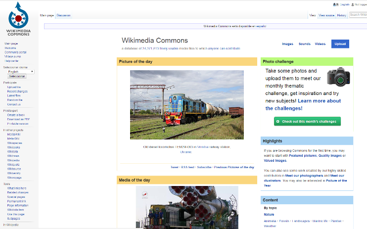
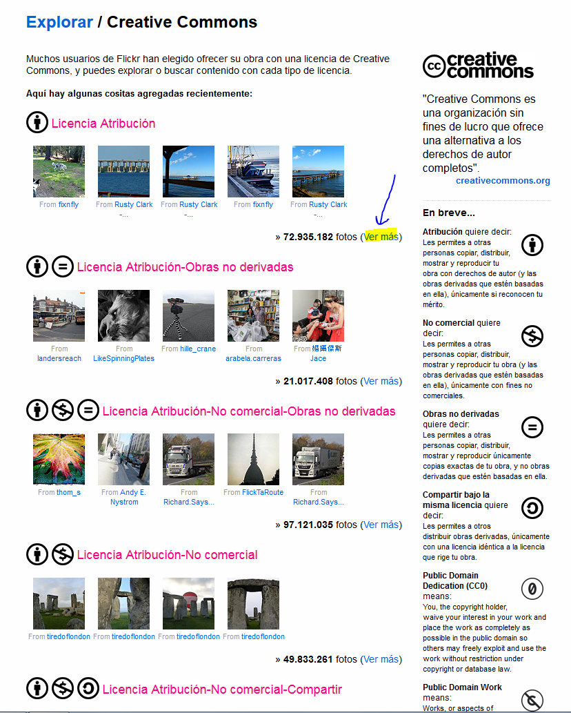

# Imágenes y sonidos

El aumento de recursos audiovisuales ha sido progresivo en la segunda década de la Red. La comunidad educativa comienza a estar especialmente sensibilizada con el uso adecuado de material multimedia para su reutilización en la elaboración de nuevos materiales o en espacios de la Web 2.0, donde cualquiera puede hoy crear un espacio propio (blogs, wikis, redes sociales, etc.).

**Cuando elaboremos materiales o preparemos alguna actividad AICLE,** ya sea un wiki, blog o página en la Red seguramente necesitaremos seleccionar algunas imágenes, animaciones o vídeos, porque como ya hemos comentado, el uso variado de recursos ayuda a la comprensión y las imágenes y vídeos pueden ser muy esclarecedores. Es importante respetar la autoría y hacer uso de los recursos de dominio público o con licencia libre que permite su reutilización, en las condiciones que el autor establezca. Si tienes dudas sobre el tipo de licencias y lo qué puedes, o no, hacer con el material que has encontrado pincha  en [Kit Digital](http://formacion.educalab.es/mod/imscp/view.php?id=39677).  

A continuación, vamos a enumerar una serie de sitios de recursos multimedia que cumplen con estas condiciones.

**[Mediatecas](https://es.wikipedia.org/wiki/Mediateca "Mediateca") (imágenes, audio, vídeo)**

*   [Wikimedia Commons](http://commons.wikimedia.org/wiki/Main_Page) que te permite, una vez introducido el término de búsqueda, acceder a los resultados de distintos servicios.
*   [Banco de Imágenes y sonidos del INTEF](http://recursostic.educacion.es/bancoimagenes/web/) que incluye vídeos, animaciones e imágenes para uso educativo no comercial y requiere el reconocimiento de la fuente.
*   [Internet Archive](http://www.archive.org/ "Internet Archive") que permite, además de buscar, alojar documentos y material audio visual.
*   [Edumedia Share](http://www.edumedia-share.com/ "Edumedia share") para compartir y usar imágenes, vídeos y otros materiales.
*   [Search Creative Commons](http://search.creativecommons.org/ "Search Creative Commons") que permite seleccionar con los criterios de antemano.
*   [Búsqueda avanzada de imágenes en Google](https://www.google.com/advanced_image_search?hl=es "Búsqueda avanzada de Google") también permite definir la licencia de uso.
*   [Pbslearningmedia](http://www.pbslearningmedia.org) banco de recursos multimedia y multiformato que te permite buscar por nivel, área o tipo de recurso. Al elegir un recurso se indica el tipo de licencia.
*   [OER Commons](https://www.oercommons.org/) Banco de recursos multimedia y multiformato que además permite la creación de REA.

Por último, en cuanto a archivos de audio, los _[podcasts](http://es.wikipedia.org/wiki/Podcasting "Podcasts")_ pueden ser otro recurso de interés en el aula AICLE, muchos espacios de recursos educativos e informativos ofrecen un banco de _podcasts_. Y de hecho, muchas mediatecas de las listadas aquí contienen _podcasts_.

*   En la sección de podcasts de la BBC, encontrarás una sección dedicada a los niños, _[BBC children](http://www.bbc.co.uk/podcasts/genre/childrens)_, que puede ser de utilidad.
*   [Sticher](http://www.stitcher.com/podcast/podcast-kid) es una aplicación que permite el poder escuchar los podcasts una vez descargados y que también tiene una sección infantil.
*   En el artículo de scholastic  [“_9 Podcasts for Teachers and Kids_”](http://www.scholastic.com/teachers/article/9-podcasts-teachers-and-kids) encuentras una selección de podcasts para profes y niños.

**Imágenes o sonidos**

*   [Morguefile](http://www.morguefile.com/archive/ "Morguefile pictures") permite transformar las imágenes y usarlas libremente; si se usan tal cual hay que referir al autor.
*   [pics4learning](http://www.pics4learning.com/) motor de búsqueda seguro, gratuito para fines educativos.
*   [Pixabay](https://pixabay.com/es/photos/?cat=education) Motor de búsqueda de  imágenes y videos libres de derechos de autor bajo la licencia Creative Commons CC0. Puedes descargarlas, modificarlas, distribuirlas y usarlas libres de pago para cualquier uso, aún para aplicaciones comerciales. No es necesaria atribución ni necesita registro.
*   [Pexels](https://intef.sharepoint.com/FORMACION_en_RED/Documentos%20compartidos/Formacion_en_RED/Moodle/Tutorizadosenlinea2017/Institucionales/AICLE_CNIIE/pics4learning%20motor%20de%20búsqueda%20seguro,%20gratuito%20para%20fines%20educativos.) ofrece imágenes libres de derechos bajo la licencia CC0, no siendo necesaria su atribución ni la necesidad de incluir el origen de las imágenes.
*   [Multicolr Search Lab](http://labs.tineye.com/multicolr/ "Multicolor search Lab") son imágenes extraídas de Flickr Creative Commons y seleccionadas por el color.
*   [Soundbible.com](http://www.pdsounds.org/catalog "Soundbible") sonidos libres de copyright.
*   [BBC School radio sound bank](http://www.bbc.co.uk/schoolradio/subjects/earlylearning/stimulussounds) Banco de sonidos para primaria de la BBC
*   [Jamendo](https://licensing.jamendo.com/es/catalogo) Música para proyectos con todos los derechos.
*   [Flickr Creative Commons](http://www.flickr.com/creativecommons/ "Flickr creative commons") Para buscar es preciso hacer clic en "ver más" en los apartados que indican el tipo de licencia.

Guardar

Guardar