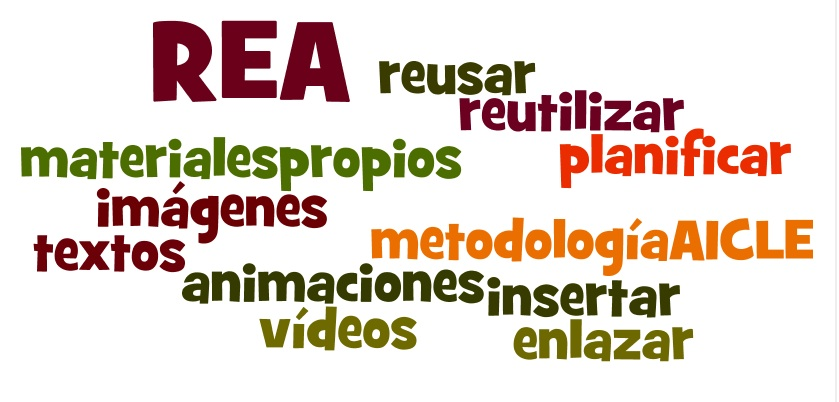

# BLOQUE III:REA y la elaboración de materiales AICLE

En el bloque de contenidos anterior hemos tenido ocasión de visitar numerosos sitios en la Red y seleccionar recursos, tanto formativos como informativos, encontrados bien en repositorios de REA como en otros, no específicamente educativos pero también útiles y de interés.

**Todos ellos nos ayudarán a mejorar y planificar el trabajo en el aula AICLE incorporándolos a los materiales que ya tenemos.**

**En el presente bloque completaremos lo aprendido sobre AICLE analizando formas posibles de utilizar los recursos que hemos seleccionado** en la práctica AICLE.

Estos recursos pueden ser utilizados de diferentes maneras:

1.  Podemos incorporarlos a nuestra práctica docente en el aula **sin necesidad de modificarlos**
2.  Podemos **modificarlos para adaptarlos** a nuestra realidad en el aula o
3.  Podemos**elaborar materiales propios.**

Así, dependiendo del tipo de recurso, éste será más o menos susceptible de ser usado de una manera u otra. Así por ejemplo, un contenido textual de dominio público o licencia que permita utilizar, compartir y modificar, nos puede servir para crear otro texto adaptando el contenido a nuestras circunstancias curriculares y de aula. Un vídeo que permita ser insertado en un blog, wiki, etc. podemos incorporarlo de esa forma a nuestros contenidos. De igual modo podremos usar una imagen u otro tipo de recurso que tenga esas características de dominio público. De no ser así, tendremos que limitarnos a enlazar el contenido pero igualmente será útil.

Por tanto, en el presente bloque apuntaremos brevemente posibles usos de esos recursos encontrados y seleccionados, sin olvidar que es ahora cuando**tendremos que volver sobre las características de la metodología AICLE y procurar usar los recursos en favor de esa metodología.**

 

