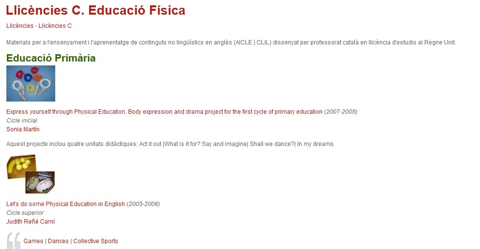

# Materiales y recursos específicos AICLE

En la anterior taxonomía hemos establecido la división de los materiales didácticos en **recursos de contenido de materia no lingüística** (ciencias, geografía, matemáticas, etc.) y contenidos específicos de lengua. En el presente apartado hablaremos de los primeros.

Por otra parte, en apartados previos hemos respondido a la pregunta de cómo encontrar recursos para usarlos en el aula AICLE y de los principales repositorios de REA. **La gran mayoría de estos REA y recursos educativos no están pensados para AICLE**. No existen repositorios de materiales propiamente AICLE como tal, aunque algunos portales educativos sí incluyen contenidos AICLE. Este es uno de los reclamos más importantes del profesorado AICLE.

**1\. ¿Dónde podemos encontrar unidades de contenido AICLE que se hayan elaborado como tal?**

He aquí algunos de los sitios que conocemos donde podemos encontrarlos, la mayoría en inglés, algunos en francés o alemán:

*   [Unidades AICLE de la Junta de Andalucía](http://www.juntadeandalucia.es/educacion/webportal/web/aicle/secuencias-aicle-elaboradas-por-el-profesorado-en-los-cep), para francés, alemán e inglés y para niveles de primaria y secundaria.

*   Materiales AICLE en el portal catalán Xtec diseñados por profesores en [**licencias**](http://srvcnpbs.xtec.cat/cirel/cirel/index.php?option=com_content&view=category&id=77:llicencies-c&layout=default) y en [**estancias**](http://srvcnpbs.xtec.cat/cirel/cirel/index.php?option=com_content&view=category&id=78:llicencies-d&layout=default) en el Reino Unido.

  

  
*   [Unidades didácticas del Proyecto Conbat+](http://conbat.ecml.at/DidacticUnits/tabid/2670/language/en-GB/Default.aspx) (_European Centre for Modern Languages_). Principalmente para 6º Primaria y primer ciclo de la ESO.
*   Materiales creados por otros compañeros y que los comparten en páginas que ellos crean o en espacios de la Web 2.0 (blogs, wikis, etc.).

Un buen ejemplo de primaria es la página del [CEIP San Miguel](http://schoolsanmiguel.blogspot.com.es/p/2-ciclo.html) donde, entre otras cosas, se encuentran numerosas unidades elaboradas por los profesores bilingües del centro.

Para ver más ejemplos, visita la página web de [Isabel Pérez](http://www.isabelperez.com/clil/clicl_m_6.htm).

** 2\. ¿Qué tipo de materiales suelen ser los más utilizados por los profesores AICLE? Y ¿cómo buscarlos?**

Además de los textos que lógicamente pueden ser útiles para el aula y para la elaboración de materiales propios a partir de ellos, los materiales que suelen ser más útiles o buscados serán: 

*   Vídeos, animaciones e imágenes de los que ya hemos hablado. Ejemplos: _[Daily routine](https://youtu.be/eUXkj6j6Ezw)_, _[Parts of a plan video](https://youtu.be/X6TLFZUC9gI)_ o _[5 things a plant needs to live song](https://youtu.be/dUBIQ1fTRzI)_

*   Tarjetas (_flashcards_), animaciones, ejercicios interactivos (_quizzes_), experimentos, presentaciones. Por ejemplo, los que se ven en las siguientes páginas: _[flashcards](http://www.mes-english.com/flashcards.php)_, [mapas interactivos](http://serbal.pntic.mec.es/ealg0027/flashmaps.htm), [ejercicios](http://eu.ixl.com/math/), [experimentos](http://www.thenakedscientists.com/HTML/experiments/), [presentaciones](http://www.pppst.com/), [animaciones](https://www.stem.org.uk/elibrary/collection/3344).
*   También, actividades más completas tipo [cazas del tesoro](http://www.isabelperez.com/taller1/aprendizaje_tareas_2.htm "cazas del tesoro"), [Webtasks](http://www.isabelperez.com/taller1/aprendizaje_tareas_4.htm "webtasks")o [WebQuests](https://aprimaryschoolteacher.wordpress.com/2012/08/18/webquests/).
*   Actividades listas para usar: muestras de editoriales _[The bean](http://www.deltapublishing.co.uk/content/pdf/the-clil-resource-pack/CLIL_U4_Lesson_1a.pdf)_, _[Life cycles](http://www.deltapublishing.co.uk/content/pdf/the-clil-resource-pack/CLIL_U4_Lesson_3b.pdf)_, _[Finish the picture](http://www.teachingideas.co.uk/subjects/finish-the-picture)_.

Elaboración propia con [Wordle ](http://www.wordle.net/)CC BY SA

Aquí hemos enlazado algunos ejemplos, pero para buscar más podemos usar la búsqueda avanzada de Google y especificar el tipo de archivo que buscamos, es decir, el tipo de extensión (ej. pdf, ppt, swf, etc.) o el tipo de actividad (ej. _flashcards_). Recuerda la sintaxis recomendada al principio de este bloque para afinar más tu búsqueda.

Por otro lado, además de los portales educativos que ya exploramos en un apartado anterior, en [inglés](http://digifolio.rvp.cz/artefact/file/download.php?file=14043&view=2893) existen numerosos sitios destinados a la enseñanza de una determinada materia y que puedes explorar según la materia de tu interés y la L2.

En los siguientes enlaces podéis dar un paseo por este tipo de recursos:

**En Inglés:**

[SEN Teacher](http://www.senteacher.org/Print/Literacy/) página originalmente ideada para estudiantes con dificultades especiales, pero útil para todo tipo de alumnos. Contiene fichas para imprimir, enlaces, descargas e instrumentos de búsqueda muy útiles para el profesor. Ofrece material de todas las áreas.

[Sparklebox](http://www.sparklebox.co.uk/) material para el aula listo para descargar. También ofrece recursos en castellano.

**En Francés:**

[Zona CLIL:](https://clil.wordpress.com/2011/10/03/secciones-bilingues-de-frances-en-primaria/) Secciones Bilingües en francés para Primaria. 

**3\. ¿Qué puedo hacer cuando el material que encuentro y me interesa no es de dominio público o de licencia libre de uso y/o modificación?**

En el caso de los vídeos, si permiten que se inserten en una web es porque el autor lo ha establecido así, pero en el caso de textos, imágenes y otros recursos que nos interesen y no sean de dominio público o no tengan una licencia libre, lo que podemos hacer es simplemente enlazarlos desde una agregador de favoritos como es [Diigo](https://www.diigo.com/) o marcador social como por ejemplo [Pinterest](https://es.pinterest.com/) o [Pearltrees](http://www.pearltrees.com/). Otra opción es crear un tablero en [Symbaloo](http://www.symbaloo.com/home/mix/13eOcLjTaQ) en el que hayas guardado todos aquellos materiales que has ido encontrando y que te vayan a ser de utilidad para tu unidad.

También podemos hacerlo desde un sitio web que tengamos, ya sea en la página de nuestro centro o en otros espacios de la Web 2.0 que hemos visto en el apartado Organización y alojamiento de materiales.
