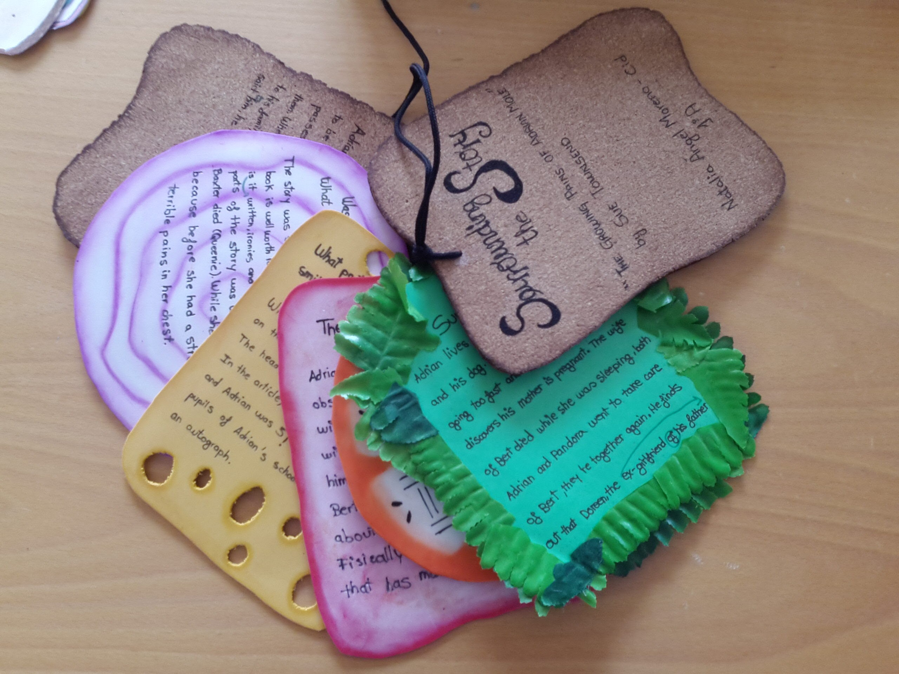

# Organizadores de ideas

**Para crear organizadores de ideas, _brainstorming_, nubes de palabras, mapas conceptuales**, útiles para:

*   Realización de lluvia de ideas, introducción de conceptos, contenidos.
*   Resúmenes de contenidos, conclusiones principales de ideas.
*   Ampliación de vocabulario agrupado por campos semánticos.
*   Realización de descripciones.
*   Explicación de temas, realización de esquemas.
*   Crear líneas temporales
*   Crear textos argumentativos y debatir a partir de los mismos.

 Herramientas:

*   [Graphic organizers](http://www.worksheetworks.com/miscellanea/graphic-organizers.html): organizadores gráficos para repasar vocabulario, hacer resúmenes, preparar una presentación
*   [Mind42](http://mind42.com/), [Bubbl.us](https://bubbl.us/), [Mindmeister](http://www.mindmeister.com/es), [Mindomo](http://www.mindomo.com/es/), [Popplet](https://popplet.com/): creación de mapas mentales.
*   [Padlet](http://padlet.com/): lienzo digital en blanco para expresar lo que quieras: conceptos, contenidos.
*   [Tagxedo](http://www.tagxedo.com/): nubes de palabras que adquieren formas preinstaladas.
*   [Wordle](http://www.wordle.net/): sencillo editor de nubes de palabras en línea, que después pueden enlazarse o embeberse en espacios web tipo blogs, wikis, etc. Para visualizar las nubes de palabras es necesario tener Java instalado en el equipo o ejecutarlo al ver una nube.

*   [**Dipity**](http://www.dipity.com/): crea líneas de tiempo interactivas que pueden embeberse en otros espacios web.
