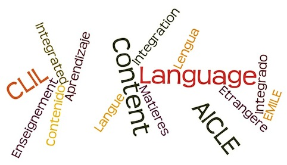

# ¿Por qué AICLE?

El panorama educativo europeo ha experimentado importantes novedades en las últimas décadas, una de ellas es la introducción de las tecnologías en el aula y el otro cambio destacable está relacionado con la enseñanza de las lenguas siendo el [objetivo](http://www.sepie.es/) que todo el mundo en Europa pueda hablar al menos dos lenguas además de la lengua materna.

Estos dos aspectos, **la introducción de las TIC y el aprendizaje de lenguas** se ven bien reflejados en el _[White Paper on Education and Training](http://cordis.europa.eu/news/rcn/7093_en.html): Teaching and Learning - Towards the Learning Society_ publicado en 1995 por la Comisión de la Comunidad Europea y en posteriores publicaciones[^1] donde se establecen los planes de acción para promover el aprendizaje de lenguas y el uso de Recursos Educativos Abiertos (REA). Ambos puntos se encuentran entre las prioridades para los estados miembro en el documento publicado en el año 2012 _[Rethinking Education: Investing in skills for better socio-economic outcomes](com669_en.pdf)_ donde se establecen entre las prioridades "Potenciar la oferta de aptitudes transversales que aumentan la empleabilidad, como la iniciativa emprendedora, las aptitudes digitales y los idiomas" e "Intensificar el uso del aprendizaje asistido por TIC y el acceso a REA de alta calidad" (p.17).

Elaboración propia con [Wordle ](http://www.wordle.net/)CC BY SA

En este contexto, a lo largo de la última década, se han puesto en marcha numerosos programas bilingües, muchos de los cuales utilizan el enfoque cuya denominación es **AICLE** en español: Integración de Contenidos y Lengua Extranjera; **EMILE** en francés: _Enseignement De Matières Par Integration D'une Langue Étrangère_ o **CLIL** en inglés: [_Content Language Integrated Learning_](https://www.youtube.com/watch?v=uIRZWn7-x2Y).

Este enfoque AICLE se identifica como un área prioritaria en el [_Action plan for Language Learning and Linguistic Diversity_](02_COM_2003_0449_FIN_EN_TXT.pdf) (_Section 1 1.2_) «_Owing to its effectiveness and ability to motivate learners»_, como aparece expreso en las páginas de la Comunidad Europea. Por otro lado, el inglés es sin duda la lengua que más se demanda en terrenos profesionales y académicos, y es por tanto, la lengua que más programas AICLE está generando, pero no es la única.

D. Coyle y otros (2010) distinguen dos razones principales por las que se sostiene el interés en AICLE dentro de un país o región. Una de ellas es una razón proactiva, como modo de promover el aprendizaje de una lengua por razones políticas, económicas y sociales. Este es el caso de los programas de inmersión en francés de Canadá, como forma de apoyar el bilingüismo, o los programas AICLE que promueve la política de la Unión Europea para fortalecer las relaciones y movilidad entre los países de la misma. La Unión Europea se ha convertido, en esencia, en un territorio sin fronteras, en cuyo seno todos los ciudadanos tienen derecho a vivir, estudiar o trabajar donde deseen; sin embargo, no saber idiomas sigue representando una barrera invisible contra la libre circulación que es preciso eliminar y los programas bilingües son una de las medidas más eficaces.

**Desde un punto de vista pedagógico** existen numerosas razones por las que los programas bilingües y AICLE son recomendables:

*   En primer lugar ofrecen ventajas para el desarrollo cognitivo de los alumnos (Bialystock, 2009).
*   Conllevan una ganancia significativa de la lengua objeto (L2) como lo demuestran numerosos estudios sobre inmersión lingüística en Canadá y AICLE en Europa.
*   Favorecen la colaboración de los profesores entre sí y con la administración del centro ya que gran parte de la comunidad se verá implicada en el aprendizaje de la lengua y contenido.

Observa cómo en el siguiente vídeo Hugo Baetens, referente en bilinguismo y CLIL de la Vrij Universiteit Brussel (VUB) alude a lo expresado en el punto anterior.  
  
https://youtu.be/ZIKmjGF3168 

* * *

Para saber más:

[^1]:[EU Policy Documents](http://ec.europa.eu/solvit/documents/index_en.htm)

[EU Languages and Language policy](http://www.letpp.eu/)

[The White Paper on Education and Training](http://europa.eu/documents/comm/white_papers/pdf/com95_590_en.pdf): Acceso al documento en su totalidad. Disponible para descarga.

Véase el [Informe Eurydice (2006)](http://bookshop.europa.eu/en/content-and-language-integrated-learning-clic-at-school-in-europe-pbNCX106001/) un estudio sobre cómo y dónde se estaba implementando CLIL en la Unión Europea.

Marsh, D. (2012). [Content and Language Integrated Learning (CLIL): A development trajectory](http://formacion.intef.es/pluginfile.php/214299/mod_imscp/content/1/2013000000658.pdf). Universidad de Córdoba.

Bialystock, E. (2009). Effects of Bilingualism on Cognitive and Linguistic Performance across the Lifespan. In I. Gogolin, & U. Neumann, Streitfall Zweisprachigkeit - the Bilingualism Controversy (S. 53 - 67). Wiesbaden: Verlag für Sozialwissenschaften

Coyle, D., Hood, P. and Marsh, D. 2010, _CLIL. Content and Language Integrated Learning. _Cambridge: Cambridge University Press.