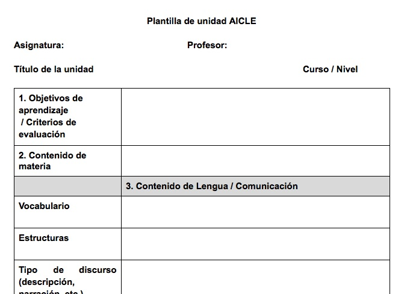

# Preparación de la unidad AICLE

**El uso de una plantilla con los elementos que hemos definido en el punto anterior puede facilitar mucho el trabajo de planificar.**

De hecho, **el uso de una plantilla** que refleje el planteamiento de la unidad o actividad tiene numerosas ventajas:

1.  En primer lugar, ayuda a reflexionar sobre la práctica que se quiere llevar a cabo y permite generar ideas, prever problemas y soluciones, etc.
2.  Es útil para informar, compartir y discutir sobre el trabajo que se está llevando a cabo con los otros profesores bilingües o con los auxiliares lingüísticos.
3.  Será también un documento útil cuando evaluemos cómo ha funcionado una actividad en la práctica en el aula y para futuras modificaciones y mejoras del planteamiento.
4.  Igualmente creemos que es de utilidad para orientar a posibles sustitutos y profesores que se incorporen por primera vez.

En el siguiente enlace encontramos un **modelo de plantilla **que tiene en cuenta todos los elementos mencionados en el anterior subapartado y que es la que hemos utilizado hasta ahora en el curso. Dicha plantilla ya la utilizamos en una de las actividades del bloque I.

**[Plantilla de unidad AICLE](https://docs.google.com/document/d/1VdkxLKeLHMS_UojHpLB7ZsR_-kRyfNlRyBPwTU2en7o/edit) **(versión en castellano)

**[Template to design a CLIL didactic unit](https://docs.google.com/document/d/1App4QmWqzHJtAGTUTt_KN7iLAQ3_jwlvAbQ6tsZHRA8/edit) **(versión en inglés)

No necesariamente debe ser ésta la plantilla a emplear pero sí es un modelo que orienta y que creemos es útil, y modificable según cada cual lo entienda en su práctica en el aula.

En el siguiente enlace verás un ejemplo de cómo usar la misma plantilla para el planteamiento de una actividad a partir de un recurso de vídeo seleccionado.[**Las plantas, 3º primaria**](https://docs.google.com/document/d/1bpB2B0zDe0UzZQ0sRK0bIKz08TCEW9dVc8DhGT7u3K8/edit)**. **Este ejemplo se ha redactado en español pero lo apropiado sería hacerlo en la lengua objeto. En este segundo ejemplo, puedes ver una unidad en inglés diseñada para 5º de primaria sobre [el sistema solar](http://sssocialscience.blogspot.com.es/).

Una vez acordado el uso de una plantilla que nos ayude al diseño, **el proceso a seguir para diseñar una unidad o actividad AICLE** será:

*   **Decidir** la unidad o parte de la unidad (o actividad) que se va a trabajar en L2 con metodología AICLE.
*   **Completar un borrador de la plantilla** considerando los distintos elementos. Lógicamente **no hay que hacerlo en orden**. A veces, podemos partir de los recursos, otras de los elementos culturales, etc. Es decir, no es un diseño vertical sino horizontal.** Tampoco es preciso completar absolutamente todos los campos**. El borrador elaborado nos orientará en el diseño final de la sesión o sesiones AICLE y ese es el principal objetivo de la plantilla.
*   **Localizar o decidir **los **recursos** que utilizaremos **(textos y/o audio, video, imágenes).**
*   **Preparar** **la tarea o actividad** considerando los recursos con los que contamos, centrándonos en el contenido y apoyando la lengua con lo que se considere oportuno (glosario, ejercicios, imágenes, etc.).
*   **Elegir** **la/s herramienta/s TIC** que se van a usar. Esto sólo en caso de querer digitalizar los materiales o hacer uso de las TIC de alguna forma, tanto para poner los recursos y materiales en la red a disposición de los alumnos, como para elaborar ejercicios, glosarios, etc. Recomendamos que se utilicen las TIC en la unidad o actividad AICLE a diseñar.

**Estos pasos no necesariamente tienen que darse en ese orden,** lo normal sería partir de los objetivos y contenidos pero en ocasiones también partiremos del recurso que hemos encontrado.

Guardar