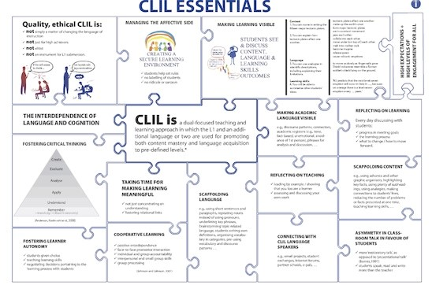

# Principios y aspectos básicos de AICLE

En el presente apartado vamos a transmitir algunas ideas que consideramos básicas en torno al AICLE y aquellos conceptos que se relacionan con la puesta en práctica de este enfoque. Así algunos de los **principios básicos** de la práctica del AICLE en el aula son:

**1\. La lengua se usa para aprender contenido del área pero también hay que aprender la lengua con objeto de comprender y comunicar.**

Es decir, el uso de la lengua es significativo porque no es el objetivo único del aprendizaje sino que hay un doble objetivo. Esto implica que** el profesor AICLE necesita tener en cuenta tanto los objetivos de materia como la lengua que se precisa, **esdecir, no sólo el currículo de la materia sino también lo que Dalton-Puffer [^1] denomina _language curriculum_.

**2\. La materia que se estudia es la que determina el tipo de lenguaje que se necesita aprender.**

Por tanto, **tanto el vocabulario específico como las estructuras o los tipos de discurso** (describir, relatar, etc.), y, también en parte, las destrezas lingüísticas que se pueden practicar (oír, escuchar, hablar, escribir o interaccionar) **vendrán determinados sobre todo por la materia que se esté enseñando** [^2]. Así en Conocimiento del Medio o Ciencias los alumnos aprenderán la lengua específica de esas materias y trabajarán con tipos de discurso propios de la ciencia. Más adelante haremos también referencia a algunas clasificaciones de la lengua que pueden ser útiles al trabajar en AICLE.

**3\. La fluidez es más importante que la precisión gramatical y lingüística en general.**

Esto es fundamental para que el aprendizaje tanto del contenido como de la lengua se desarrolle con confianza. **No obstante será preciso aprovechar las oportunidades que surjan para prestar atención a la forma lingüística** puesto que si se comenten muchos errores esto puede afectar a la comprensión y producción del contenido de materia. Un concepto clave para ayudar a trabajar la forma lingüística es el concepto de "andamiaje" o _scaffolding _en inglés. Concepto del que hablaremos en muchos momentos en este curso.

Como se observa, cualquiera de estos principios refleja que **en AICLE es imprescindible la colaboración entre los especialistas de la L2 y los especialistas de las distintas materias,** tanto a la hora de diseñar materiales como al diseñar el trabajo en el aula.

En los dos subapartados siguientes vamos a tratar de aspectos y conceptos claves mencionados al enunciar estos principios: la **identificación de la lengua** que se precisa y el concepto de **_scaffolding_ o andamiaje**. El tercer subapartado tratará de cuáles son los factores que hacen que el **aprendizaje** en general sea efectivo, es decir **visible**.

Por último, en el siguiente cuadro elaborado por Mehisto and Lucietto (2010) y alojado en abierto online se reflejan algunos otros aspectos que ellos denomina esenciales en AICLE "CLIL essentials", muchos de los cuales van aparecer en el resto de páginas de este bloque, de una u otra forma. Si pinchas en la imagen accederás al cuadro y luego dentro del mismo debes hacer clic sobre cada uno de los cuadros tanto para abrirlos como para cerrarlos. Eso sí, está sólo en inglés. Para abrirlo, recomendamos usar Internet Explorer.

* * *

[1]: Dalton-Puffer, C. 2007. _Discourse in CLIL Classrooms_. Amsterdam:Benjamins.

[2]: Una investigación de interés en relación con la lengua que se utilizar en el aula AICLE es: Llinares, Ana, Tim Morton and Rachel Whittaker, _The roles of Language in CLIL_, Cambridge University Press, 2012.
