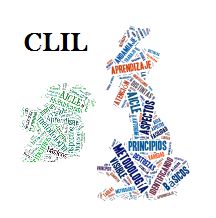

# ¿Qué es AICLE?

En esencia **el enfoque AICLE consiste en enseñar contenidos y lengua a la vez**, de una forma integrada, de manera que **se utiliza la lengua con el objetivo de aprender contenidos y viceversa**. Veamos algunas definiciones del término.

El término CLIL (AICLE) fue utilizado por primera vez por David Marsh en 1994:

"_**CLIL refers to situations where subjects, or parts of subjects, are taught through a foreign language with dual-focused aims, namely the learning of content, and the simultaneous learning of a foreign language**_". (Marsh, 1994).

En el siguiente video puedes escuchar a D. Marsh explicando el nacimiento de la idea:

https://www.youtube.com/watch?v=8BtqN6ea75E 

Una definición que expresa mejor el **modo entrelazado en que se integra la lengua y el contenido** así como el énfasis compartido en ambos aspectos en el AICLE es la enunciada a continuación:

"Content and Language Integrated Learning (CLIL) is a dual-focused educational approach in which an additional language is used for the learning and teaching of both content and language. That is, in the teaching and learning process, there is a focus not only on content, and not only on language. Each is interwoven, even if the emphasis is greater on one or the other at a given time." Coyle, Hood and Marsh (2010:1).

El enfoque AICLE tiene semejanzas con otros enfoques de inmersión bilingüe y de enseñanza de lenguas, como es la enseñanza de lengua basada en contenidos (CBLT- _Content Based Language Teaching_), pero la diferencia reside, en que en el caso de CBLT el contenido se trabaja en la clase de la lengua extranjera objeto (L2) y el énfasis en realidad está en la lengua aunque se vale del contenido. En cambio, el enfoque AICLE implica que se enseña lengua y contenido a la vez y en la clase de contenido, compartiendo el énfasis tanto en la lengua como el contenido. Lo que implica la necesidad de utilizar una metodología que favorezca dicho aprendizaje dual. En cuanto a la diferencia con programas de inmersión bilingüe destaca la alternancia de código, es decir, el hecho de que en AICLE la lengua materna o L1 también se usa, así la L1 y la L2 se alternan en algunos momentos del aprendizaje.

Este cambio metodológico refleja el cambio de la sociedad en la que vivimos. David Marsh, en El Prólogo de _Echando Una Mano: 101 Técnicas De Andamiaje CLIL_ relata como “El «dime por qué» de generaciones anteriores ha sido sustituido por «enséñame cómo» de esta generación, formada por jóvenes que necesitan sentir la inmediatez de un propósito cuando aprenden. «Aprende cuando utilices y utiliza cuando aprendas» bien podría ser el mantra de las nuevas generaciones, y CLIL es particularmente apropiado para la forma de pensar de hoy en día»”.

En este contexto son diversos los programas educativos que se llevan a cabo basados en la enseñanza AICLE. Algunas de las variables a considerar son:

1.  **Duración del programa**, es decir, en muchos casos el programa se desarrolla a lo largo de toda la etapa, comenzando por el año uno de la misma (de 1º a 4º de ESO , por ejemplo), pero en otros programas la duración es modular y no dura necesariamente todo el curso o etapa. Esta última no suele ser la situación que más se da en España pero sí en otros países como Alemania o Austria.
2.  **Uso de la lengua objeto**: esta variable determina qué cantidad de la materia en cuestión se enseña en la lengua objeto y esto influye en el tipo de programa. Esta variable oscila entre el treinta y el cincuenta o incluso cien por ciento de la materia. El uso de la L1 no es un obstáculo para que el aprendiz progrese en la L2, sino que hay investigaciones que avalan que la alternancia de código lingüístico puede facilitar el aprendizaje [^1].
3.  **Áreas que se imparten**: lo que está directamente relacionado con el vocabulario y con la lengua específica que se empleará.
4.  **Niveles de interacción** con la lengua objeto: es decir las oportunidades con las que cuenta el alumnado de tomar contacto con la lengua. Así podemos referirnos a tres tipos de escenario, micro, medio y macro (Leo Van Liar, 2004), donde la relación sería de menor a mayor contacto.

Todas estas variables configuran escenarios diferentes que influirán en el diseño de los programas a llevar a cabo en los centros. **Por ejemplo, si consideramos el caso del programa bilingüe Modelo BRIT-Aragón**, las variables anteriores se configuran como sigue: el programa se imparte en toda la etapa en la que está aprobado. La L2 se usará un mínimo del 35 %, y las materias a impartir serán las que determine el propio centro educativo diseñando su propio Itinerario Bilingüe. En cuanto al nivel de interacción, dado que la L2 no se usa en el ámbito social (entorno, televisión, etc.), por lo general será un escenario micro aunque en algunos casos podría ser tipo medio.

* * *

[1]: Lin, A. M. (2008). Code-Switching In the Classroom: Research Paradigms and Approaches. In K. A. King, & N. H. Hornberger, _Encyclopedia of Language and Education_ (pp. 273-286). New York: Springer.

Coyle, D., Hood, P. and Marsh, D. 2010, _CLIL. Content and Language Integrated Learning. _Cambridge: Cambridge University Press.

Marsh, D. 1994. Bilingual Education & Content and Language Integrated Learning. International Association for Cross-cultural Communication, Language Teaching in the Member States of the European Union (Lingua) University of Sorbonne. Paris

Fields, Donna Lee .2016 _Echando una mano: 101 técnicas de andamiaje CLIL_, Editorial Octaedro, S.L.

Fields, Donna Lee. _2016 Echando una mano: 101 técnicas de andamiaje CLIL_. [Material descargable](http://formacion.intef.es/pluginfile.php/214299/mod_imscp/content/1/03_12018.pdf). Editorial Octaedro, S.L.