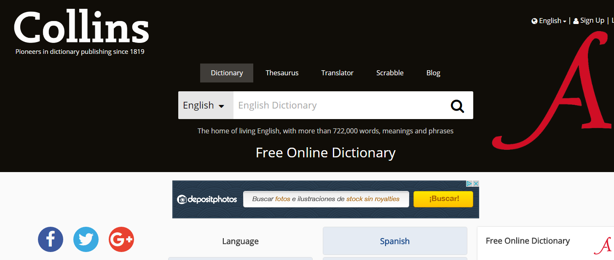

# Recursos lingüísticos específicos de L2

En este apartado vamos a tratar de  aquellos **recursos **y **materiales específicos para el aprendizaje de la lengua**, que en muchos casos se pueden utilizar en la clase AICLE para apoyar el aprendizaje de lengua y contenido. Te recomendamos visitar la web de la asesora del [CARLEE](https://www.carleearagon.es/), [Natalia López](https://natalialzam.wordpress.com/), con numerosos recursos, artículos y consejos sobre este tema. Para el profesorado de francés, recomendamos el [blog de Pepe Mas](https://francescarlee.blogspot.com/), asesor del [CARLEE ](https://www.carleearagon.es/)en lengua francesa.

De forma general hablaremos de recursos específicos para la L2 para luego especificar aquellos más específicos de Infantil/Primaria.

Fundamentalmente, destacamos los diccionarios, glosarios, aplicaciones(o páginas web) para mejorar la pronunciación o la gramática. En el caso de los más jóvenes, cuanto más lúdicos sean estos recursos, mucho mayor será su avance. Asimismo, el mundo de las nuevas tecnologías ha abierto las puertas a una nueva manera de aprender, abriendo las puertas del aula y así logrando que la motivación del alumnado y el deseo de aprender no termine en las puertas del colegio.

  

En primer lugar vamos a destacar los **diccionarios**, sobre todo los que ofrecen imágenes y pronunciación. Así, por ejemplo, encontramos desde diccionarios tradicionales muy completos [^1] a diccionarios interactivos, que transforman una página en un corpus con opción a traducir cada una de las palabras en el mismo contexto de la página [^2] o diccionarios visuales [^3] o sólo de pronunciación [^4]. Este tipo de recursos pueden darse a conocer a los alumnos para que hagan uso de ellos cuando los necesiten, de una manera autónoma. A continuación destacamos algunos enlaces útiles.

Los **glosarios** específicos de materias serán también una herramienta muy útil para apoyar el aula AICLE, algunos ejemplos en inglés [Audioglosario de Geografía de 1º ESO, ](http://www.students.linguaframe.com/gh1-audio-glossary)[Diccionario de matemáticas](http://www.amathsdictionaryforkids.com/dictionary.html). Un enlace interesante es el glosario para [profesores CLIL](http://www.cambridgeenglish.org/images/22194-tkt-clil-glossary-document.pdf) de la Universidad de Cambridge Más enlaces de este tipo pueden consultarse en [esta página](http://isabelperez.com/tesllinks2.htm).

**Otros recursos específicos de lengua** que pueden ser útiles son aquellos que van a permitir a los alumnos mejorar la pronunciación y los aspectos gramaticales de la lengua. Este tipo de recursos pueden ser proporcionados para que el alumno pueda practicar y mejorar en el aula de L2 y fuera de ella. Un ejemplo son las actividades desarrolladas con [MALTED](http://recursostic.educacion.es/malted/web/) o los mismos ejercicios de la plataforma [AGREGA](http://agrega.educacion.es/visualizadorcontenidos2/Portada/Portada.do;jsessionid=10A682EE35AD8F0D7BCF36BDDFEB4D85). Encontrarás muchos enlaces de interés para estos dos aspectos en los siguientes enlaces:

 Para practicar gramática: [Englishmedialabs ](http://www.englishmedialab.com/elementaryquizzes.html), [English Grammar Games](http://www.eslgamesworld.com/members/games/grammar/) o [Sentence Monkey](http://www.eslgamesplus.com/sentence-monkey/)

Para practicar pronunciación: [English4kids](http://www.english-4kids.com/phonicsheets.html), [learning through Nursery rhymes](http://www.enchantedlearning.com/Rhymes.html)

Específicos de **infantil**:

[Picture dictionary](http://www.storytimestandouts.com/free-early-literacy-printables-children/picture-dictionaries/) vínculo a recurso descargable e imprimible en pdf.

[Online Picture Dictionary](http://www.esolhelp.com/online-picture-dictionary.html) Imágenes ordenadas alfabéticamente. Sin pronunciación.

[Starfall](http://www.starfall.com/n/level-k/index/load.htm). Funciona con flash. El niño aprende el alfabeto y _phonics_ al mismo tiempo. También muestras recursos para la lectoescritura.

[Picture That](http://www.ipicthat.com/index.php?m=scenarios) Imágenes con vocabulario dependiendo del lugar elegido.

**Recursos para el trabajo de la L2 en francés. **

[Educalandia:](http://www.educalandia.net/alumnos/busqueda_tematica.php?palabra_clave=franc%E9s) recursos para trabajar vocabulario en francés con los más pequeños a través de juegos en francés.

[Recursos para la enseñanza del francés en Primaria e Infantil](http://www3.gobiernodecanarias.org/medusa/ecoescuela/recursoseducativos/tag/francais/) en la web de la Consejería de Educación y Universidades del Gobierno de Canarias. 

[Recursos educativos para Francés](https://jesusalonsorueda.webnode.es/frances/) en el blog de Jesús A. Alonso Rueda. 

Además de las aquí mencionadas, existen muchas [apps](https://es.pinterest.com/pin/226517056234339424/) para usar en los dispositivos móviles que el docente y los padres pueden usar para incentivar el aprendizaje de la L2.

\_\_\_\_\_\_\_\_\_\_\_\_\_\_\_\_\_\_\_\_\_\_\_\_\_\_\_\_\_\_\_\_\_\_\_\_\_\_\_\_\_\_\_\_\_\_\_\_\_\_\_\_\_\_\_\_\_\_\_\_\_\_\_\_\_\_\_\_\_\_\_\_\_\_\_\_

  
[1]: [Macmillan Dictionary](http://www.macmillandictionary.com/), [Oxford Dictionary](https://en.oxforddictionaries.com/), [Cambridge Thesaurus](http://dictionary.cambridge.org/es/index.html), [Wordreference.com,](http://www.wordreference.com/)  
[2]: [Lingro.com](http://lingro.com/),  
[3]: [Merriam Webster visual dictionary](http://visual.merriam-webster.com/index.php), [Shahi visual dictionary,](http://blachan.com/shahi/) [Lo que veo](http://www.leoloqueveo.org/), [Language guide](http://www.languageguide.org/english/) (en muchas lenguas)  
[4]: [Howjsay](http://www.howjsay.com/)