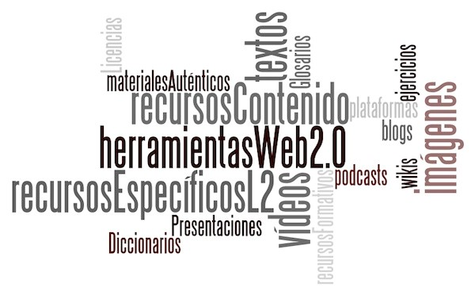

# Taxonomía de REA y de otros recursos

**Desde una perspectiva amplia,** podemos clasificar los recursos que nos van a servir tanto para ser usados en el planteamiento de unidades AICLE como los que nos servirán para crear materiales partiendo de REA, distinguiendo los siguientes **tres bloques.** 

1. **Recursos y materiales didácticos **\(REA y otros; todo tipo de formatos\).

   * **Recursos del contenido de las materias no lingüísticas** \(ej. presentaciones, vídeos, etc. de ciencias naturales, historia...\).
   * **Recursos y materiales específicos de la L2 **\(ej. diccionarios online, ejercicios interactivos, etc.\).
   * **Herramientas para la elaboración de materiales y creación de espacios de interacción** \(ej. blog, wikis, plataformas, etc.\). De estos trataremos en el tercer bloque, donde trataremos de la propia creación o modificación de los recursos encontrados.

2. **Recursos y materiales auténticos** \(todo tipo de formatos\).

3. **Recursos para el profesorado, de tipo formativo e informativo **\(vídeos, experiencias, artículos, páginas webs de intercambio de material, etc.\).  

Algunos de los recursos serían claramente REA y otros no, pero igualmente podrían usarse, al menos como enlaces, dentro de una unidad o actividad AICLE.

Por otro lado, de acuerdo al tipo de recursos que nos encontramos en la Red, los **REA** pueden dividirse en tres grupos[^1]:

* **Contenidos educativos: **cursos completos \(programas educativos\), materiales para cursos, módulos de contenido, objetos de aprendizaje, libros de texto, materiales multimedia \(texto, sonido, vídeo, imágenes, animaciones\), exámenes, compilaciones, publicaciones periódicas \(diarios y revistas\), etc. Un ejemplo de este tipo de REA es [Wikipedia](http://www.wikipedia.org/) o los recursos de la plataforma de la [UNESCO](http://www.oerplatform.org/). 
* **Herramientas: **software para apoyar la creación, entrega \(acceso\), uso y mejora de contenidos educativos abiertos. Esto incluye herramientas y sistemas para: crear contenido, registrar y organizar contenido; gestionar el aprendizaje; y desarrollar comunidades de aprendizaje en línea. Como por ejemplo la plataforma que usamos en este curso: [Moodle](https://moodle.org/), el programa [eXeLearning](http://exelearning.net/)
* **Recursos de implementación**: licencias de propiedad intelectual que promuevan la publicación abierta de materiales; principios de diseño; adaptación y localización de contenido; y materiales o técnicas para apoyar el acceso al conocimiento. Por lo general, quienes crean REA, permiten que cualquier persona use sus materiales, los modifique, los traduzca o los mejore y, además, que los comparta con otros. Se debe tener en cuenta que algunas licencias restringen las modificaciones \(obras derivadas\) o el uso comercial. Para ello, debes reconocer qué permite cada licencia así como publicar tu trabajo con la licencia correspondiente. Te aconsejamos revises los conocimientos de las licencias [Creative Commons](http://creativecommons.org/).

En los próximos apartados profundizaremos más en todos estos tipos de recursos.

---

\[1\]: División procedente del artículo de Juan Carlos López García en Eduteka. "[Recursos Educativos Abiertos](http://eduteka.icesi.edu.co/articulos/OER)" bajo licencia Reconocimiento – NoComercial – CompartirIgual \(by-nc-sa\)

