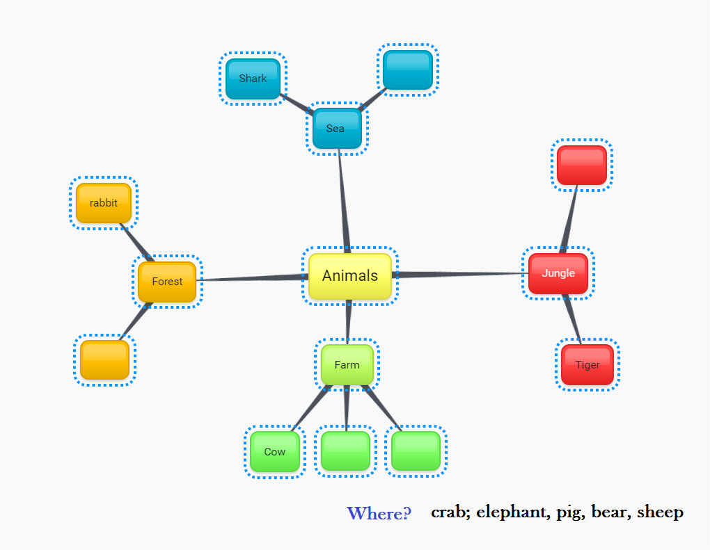

# Trabajo por tareas

### Trabajo por tareas [^1]

**5**. Por último, la metodología AICLE está muy relacionada con el **aprendizaje enfocado a procesos y tareas** porque esta aproximación permite un aprendizaje más significativo y que el alumnado se sienta más involucrado en el aprendizaje.

Por tarea entenderemos "aquella **actividad que requiere que los alumnos usen la lengua, poniendo el énfasis en el significado, para obtener un objetivo**" \(Bygate, Skehan, and Swain, 2001:11\). Por tanto, la tarea será la unidad esencial que implicará la realización de una serie de una o más actividades para conseguir realizar u obtener el producto final propuesto en la tarea.

En AICLE las mejores tareas serán aquellas que promuevan tanto el aprendizaje de los contenidos de la materia como el uso comunicativo de la L2 y la práctica de algunas de las destrezas lingüísticas \(Leer, escuchar, hablar o escribir\).

**Las buenas tareas deben estar sobre todo**:

* Vinculadas a los objetivos del currículo,
* Enfocadas al significado y contenido y no a la lengua aunque se incluyan actividades que se centren en la lengua,

Por otro lado, vamos a distinguir entre **tareas de recepción y tareas de producción**. Las tareas de recepción consisten fundamentalmente en escuchar y leer. En este tipo de tareas los textos y materiales audio se abordarán con estrategias lectoras que hagan posible que el alumno vaya encontrando el significado a medida que vaya haciendo actividades, en lugar de abordarlos de una forma directa.

Ejemplos de **tareas de recepción** son: recopilar o contrastar información sobre un tema, analizar y/o comprender un tema, etc.

A continuación se enumeran algunas actividades que se pueden utilizar en el proceso para llevar a cabo tareas de recepción:

* Asignar etiquetas o nombres, distribuir contenido. [Animals parts of the body](http://formacion.intef.es/pluginfile.php/214299/mod_imscp/content/1/08_Animals_parts_of_the_body.pdf), [Lex animaux marines.](http://clic.xtec.cat/db/act_es.jsp?id=2017) 
* Elegir parte del contenido de acuerdo a un criterio dado, etc. [Animal Riddle](http://www.meddybemps.com/riddles/Index.html)
* Completar tablas, líneas del tiempo, diagramas, mapas conceptuales, etc.

* Tomar notas de datos concretos, fechas, etc. 
* Identificar y/o reorganizar información o imágenes, corregir errores, etc. [Sounds and animals](http://lessonplananimalsounds.blogspot.com.es/2011/01/lesson-plan-in-science-k1-animal-sounds.html), [Sonidos de animales \(español - frances\)](https://quizlet.com/12581598/sonidos-de-animales-frances-espanol-flash-cards/)
* Interpretar imágenes. [Animal forest flashcards](http://sheppardsoftware.com/preschool/animals/forest/animalforestflashcards.htm)

**Las tareas de producción** corresponden a la práctica de estrategias que implican expresarse e interactuar de forma oral y escrita. Estas tareas son las más complicadas en principio y normalmente requieren que el alumno sea entrenado y apoyado con actividades de andamiaje que le den seguridad.

Ejemplos de actividades de producción son: diseñar algún objeto o producto; elaborar algún tipo de documento; hacer una valoración; proponer una solución o una hipótesis; realizar una entrevista, etc. Dependerá en gran medida de la materia y los temas que se estén trabajando.

Por otro lado, algunas de las estrategias y actividades que pueden realizarse como parte del proceso de andamiaje y de realización de una tarea de producción pueden ser:

* Completar huecos en textos o parte de los textos. [Los transportes \(2ª Primaria\)](http://formacion.intef.es/pluginfile.php/214299/mod_imscp/content/1/09_everything_closer.pdf)
* Terminar frases.
* Responder a preguntas de comprensión del texto o audición, etc.
* Contestar cuestionarios de opinión, buscar información en distintos recursos: libros, Internet \(búsqueda guiada\), p.e., vídeos de animales en [Vidipedia](http://www.vidipedia.org/)
* Llevar a cabo "cazas del tesoro" buscando información específica, [Food treasure hunt](http://busyteacher.org/16118-food-treasure-hunt.html).
* Preparar una [presentación](http://kickinitinkindergarten.com/want-know-kindergarten-oral-presentations/) oral.

**Cuando planeamos un trabajo por tarea, al definirla habrá que pensar en el producto final y el formato que utilizaremos. **Volveremos sobre este tema cuando hagamos referencia al diseño de materiales AICLE. Los formatos dependerán de los medios que se utilicen y de las características del proceso de la tarea. Pueden ir desde un mini proyecto a una [webtask](http://poster.4teachers.org/worksheet/view.php?id=87047) o [webquest](http://zunal.com/tasks.php?w=2674), si se utiliza la web como medio.  
En cuanto** al producto final de la ejecución de una tarea** puede ser un mural, una presentación digital, un documento, una presentación oral, una grabación, una exposición, etc.

Lo último que queremos apuntar es que, a efectos prácticos, se debe comenzar con tareas sencillas que permitan que el alumnado no se sienta perdido y frustrado, incrementando la complejidad si se van mejorando destrezas. Y siempre utilizando las estrategias de **andamiaje** necesarias para apoyar la construcción del conocimiento.

\_\_\_\_\_\_\_\_\_\_\_\_\_\_\_\_\_\_\_\_\_\_

\[1\]: Pérez Torres, I. 2009a. "Apuntes sobre los principios y características de la metodología AICLE" en V. Pavón, J. Ávila \(eds.\), Aplicaciones didácticas para la enseñanza integrada de lengua y contenidos. Sevilla: Consejería de Educación de la Junta de Andalucía-Universidad de Córdoba.171-180.

Bygate,M., P.Skehan, M.Swain \(eds\). 2001. \_Researching pedagogical tasks: second language learning, teaching, and assessment. \_London: Pearson

