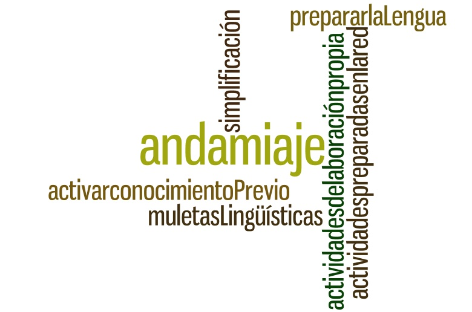

# Uso y transformación de REA

A la hora de elegir un contenido y/o recurso de cualquier tipo habrá que considerar la idoneidad del mismo para el objetivo pretendido tanto desde el punto de vista del contenido del área como de la lengua.

Supongamos que seleccionamos un recurso de vídeo con el **objetivo** de introducir el tema de la materia que estemos tratando; necesitaremos analizar tanto el contenido del vídeo en relación con el tema de la materia, como en relación con el nivel de la lengua usada, y a partir de ahí** considerar de qué forma se puede llevar al aula y qué otros recursos vamos a necesitar para apoyar y facilitar el trabajo** y el aprendizaje de forma que el alumno se encuentre apoyado y ayudado en el proceso.

A continuación damos una serie de **orientaciones**  útiles a la hora de usar y transformar los recursos para el aula AICLE:

En el caso de **TEXTOS**, **ya sean documentos, presentaciones** u **otro tipo,**cuya**licencia permita** que se modifiquen:

*   Aunque hay que procurar que no se elimine la naturalidad de la lengua, siempre se puede considerar la posibilidad de adaptarlos o simplificarlos.
*   Esta **simplificación** se puede hacer cambiando, sustituyendo o eliminando algunas palabras o expresiones que no aporten información y sí confusión.
*   Otra solución a este problema de la simplificación sin perder la naturalidad es utilizar **textos** semejantes pero destinados a**alumnos de menor edad**, lo que de alguna manera equivaldría a un tipo de simplificación. Así, si has encontrado una actividad para infantil pensada para niños con inglés como su L1, puedes usarla para alumnos de Primaria.

**Además,**tanto en el caso de textos como en el caso de imágenes, vídeos, _flashcards_ y otros recursos interactivos que no se puedan o no sean fáciles de modificar y simplificar:

*   Cualquier recurso que seleccionemos, ya sea un texto, un vídeo, una imagen, una animación, una presentación, etc. puede necesitar un**apoyo o ayuda** para trabajar con el mismo y que su uso sea realmente útil sin causar frustración por la dificultad del contenido lingüístico.

*   Ese apoyo puede ser muy diverso, dependiendo del contenido. Así por ejemplo podemos ofrecer un **glosario**, o pedir que el alumno complete una **tabla o línea del tiempo**, o que previamente o a posteriori haga algún ejercicio con el vocabulario o las estructuras lingüísticas correspondientes, etc.  
    .

Estas actividades de apoyo o **_scaffolding_** (andamiaje), se pueden encontrar igualmente ya **preparadas en la red **o**se pueden elaborar** usando también recursos digitales, es decir, algunas herramientas de las que encontramos en la red y que por ejemplo nos permiten crear mapas conceptuales, líneas del tiempo, ejercicios de completar o enlazar, etc. Veremos algunas de estas herramientas en apartados posteriores.

Elaboración INTEF CC-BY-SA

**En cualquier caso**, siempre que sea necesario conviene:

Por un lado, **preparar la lengua** previamente a la lectura, o a la presentación, vídeo, etc. Esto se puede hacer simplemente comentando el vocabulario o por medio de glosarios y ejercicios que permitan que el alumno se familiarice con el vocabulario y estructuras necesarias. [Aquí](http://clil4teachers.pbworks.com/w/file/fetch/82495513/vocabulario%20antes%20del%20dia.pptx) tienes un ejemplo de español como lengua extranjera.

Y por otro, indagar acerca del conocimiento previo que los alumnos tengan sobre el tema, rescatando lo conocido y aportando algún conocimiento previo más, lo que facilitará la comprensión de la lectura, el vídeo, etc. Para alumnos más jóvenes, puedes usar la técnica conocida como [_the Carousel Strategy_](http://www.readwritethink.org/professional-development/strategy-guides/brainstorming-reviewing-using-carousel-30630.html)_._ También puedes usar una plantilla como la que encuentras en [ReadWriteThink](http://www.readwritethink.org/files/resources/printouts/KWL%20Chart.pdf) o basarte en ella para crear la tuya propia.

*   Por último, cuando a partir de un recurso, se pida que el alumno produzca por escrito u oralmente, es recomendable que se ofrezcan lo que denominamos "**muletas lingüísticas**" que consiste en los marcos de estructuras que van a necesitar y también guías de cómo realizar la producción, ya sea una presentación, exposición, descripción, etc. (ej. _[expressing your opinion](https://docs.google.com/document/d/1dPvGwkCqYgTYTnTeHl6ZwkqD4krjXeZCEkVt4ddjHhE/edit)_).
*   Asimismo, conviene no olvidar el espacio que les rodea: el verse rodeados de la L2   les va a permitir interiorizar ese vocabulario más fácilmente. Aunque puedes crear con los alumnos muchos d estos recursos, también puedes encontralos en páginas como, por ejemplo,  [MrsPancake](http://mrspancake.com/index.php) o [Schoollinks](http://schoolslinks.co.uk/). Para el aula de [Infantil](http://www.communication4all.co.uk/HomePage.htm), donde además encontrarás recursos para Alumnos con Necesidades Educativas Especiales (SEN en inglés).

\_\_\_\_\_\_\_\_\_\_\_
