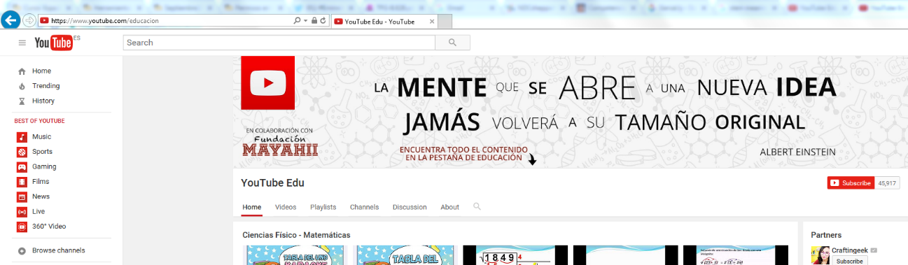
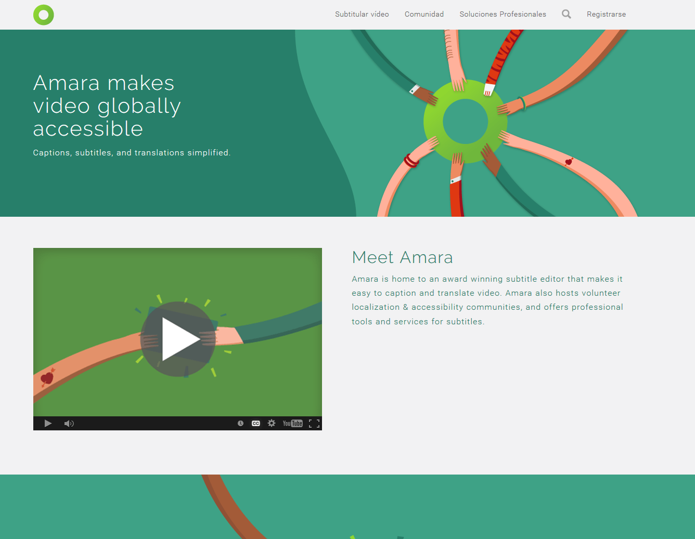

# Vídeo

En este subapartado vamos a referirnos a la **búsqueda de vídeos a la hora de preparar sesiones y materiales para el aula AICLE**. Será en el bloque 3 dónde te enseñaremos cómo modificar esos vídeos para adaptarlos a tu aula. Al igual que las imágenes, su uso puede contribuir a la comprensión del contenido y de la lengua. Además **el vídeo promueve la práctica de la destreza de escuchar,** al igual que los podcasts, pero con el apoyo de imágenes.

En las mediatecas enlazadas anteriormente también podemos encontrar vídeos, pero en esta sección vamos a referir sitios específicos de vídeos.

**La búsqueda de vídeos** se puede hacer mediante [Google Videos](http://video.google.com/ "Google videos"), que busca en todos los otros repositorios de vídeos, pero también se puede recurrir a los **espacios educativos que contienen vídeos**, en muchos casos creados por compañeros, profesores y también por alumnos. En algunos de estos sitios en los que también podemos subir nuestros propios vídeos:

  
YouTube ofrece no sólo su  canal [YouTube Educación](http://www.youtube.com/education?t=m "You Tube educación") donde contribuyen y comparten los profesores catalogando los vídeos subidos sino que puedes subscribirte a aquel canal que más vayas a aprovechar en tu práctica docente. En [este artículo](http://www.educatorstechnology.com/2013/11/30-youtube-channels-for-teachers.html) (en inglés) encontrarás los 30 canales de YouTube recomendados por _Educators Technology_.

*   [Edutopia videos](https://www.edutopia.org/videos)  videos que evidencian la práctica educativa en primaria en EEUU.  Pueden ser muy útiles para el propio docente a la hora de buscar experiencias nuevas para su aula, así como para los alumnos.Recomendamos ver _[Engaging Parents of English-Language Learners](https://www.edutopia.org/blog/engaging-parents-english-language-learners)_.
*   [Vimeo](http://vimeo.com) es una de las mejores opciones para compartir y encontrar vídeos, con una búsqueda avanzada que permite seleccionar la licencia.
*   [Videopedia ](http://www.vidipedia.org/)la wikipedia de los vídeos.
*   [HowStuff Works ](http://videos.howstuffworks.com/)Vídeos interesantes de muchos temas educativos.
*   [Slowmation](http://www.slowmation.com/) página australiana con videos de ejemplo y material educativo sobre la creación de videos explicativos para infantil y primer ciclo primaria.
*   [Watch, Know, Learn](http://www.watchknowlearn.org/Category.aspx?CategoryID=497) es otro canal con multitud de temáticas educativas.
*   [NeoK12](http://www.neok12.com/) Videos y juegos educativos primaria.
*   [Khan Academy ](https://www.khanacademy.org/#search-khan-academy "Khanacademy")Uno de los repositorios educativos de vídeos que más ha progresado y que incluye sobre todo vídeos de ciencia y matemática pero que está expandiéndose en otras áreas. Aunque los vídeos son en inglés muchos están subtitulados y se puede colaborar en la subtitulación igualmente.
*   [Teacher TV ](https://www.education.gov.uk/schools/toolsandinitiatives/teacherstv/ "Teacher TV")espacio del departamento de Educación del Reino Unido donde aparecen otros enlaces a vídeos educativos que pueden ser de mucho interés para AICLE en inglés.

Estos vídeos que encontramos en la Red suelen permitir ser insertados en otras páginas, blogs o wikis; la otra opción que tenemos es enlazarlos o  descargarlos usando distintas aplicaciones, dependiendo del sistema operativo que tengamos y del navegador.

También conviene que te descargues **el programa **[**VLC**](http://www.videolan.org/vlc/) **Media Player** para visualizar casi todo tipo de vídeos. Es un reproductor multimedia con alta compatibilidad en diversos sistemas operativos. Haz clic [aquí](http://www.videolan.org/vlc/download-windows.html "VLC") para descargarlo. Es recomendable que lo descargues en un _pendrive_ para que puedas usarlo en aquellos ordenadores donde no está previamente instalado.

**Subtitular Vídeos**

En ocasiones el vídeo que queremos utilizar en el aula nos interesaría que estuviera parcial o totalmente subtitulado (el porcentaje de subtítulos puede ser un claro ejemplo de andamiaje); para eso podemos emplear algunos de los sitios web que están destinados a ese fin. Te recomendamos:

*   [Amara](http://www.amara.org/es/): Para insertar subtítulos online en vídeos ya en la red. Requiere registro.
*   [Dotsub](http://dotsub.com/): Para insertar subtítulos online en vídeos ya en la red. Requiere registro.
*   [YouTube](https://support.google.com/youtube/answer/2734796?hl=es): Para subir un vídeo e introducirle subtítulos.

